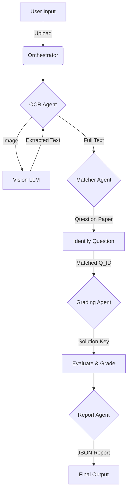

# 📝 MCP Handwritten Paper Automation

> A powerful Multi-Agent System for automating the evaluation of handwritten answer sheets using Vision-Language Models (VLMs) and Intelligent Reasoning.


## 📖 Overview

**MCP Handwritten Paper Automation** is an end-to-end solution designed to digitize and automate the grading of handwritten exams. By leveraging state-of-the-art Vision-Language Models (like Qwen 2.5-VL and InternVL2), the system can read handwritten text, understand the context of questions, match answers to the correct questions, and grade them against a solution key with high accuracy.

The project is built with a modular **Multi-Agent Architecture**, making it scalable and easy to extend. It offers multiple interfaces including a REST API, an interactive Streamlit Dashboard for debugging, and a Model Context Protocol (MCP) server integration.

## 🏗️ Architecture

The system operates on a pipeline of specialized agents, each responsible for a distinct stage of the evaluation process:



### Components
1.  **OCR Agent (`agents/ocr_agent.py`):** Uses Hugging Face Inference API (defaulting to `Qwen/Qwen2.5-VL-7B-Instruct`) to transcribe handwritten text from images. Handles fallback to backup models (`InternVL2-8B`).
2.  **Matcher Agent (`agents/matcher_agent.py`):** Analyzes the extracted text to identify which question from the Question Paper is being answered.
3.  **Grading Agent (`agents/grading_agent.py`):** Compares the student's answer against the Solution Key (Text or JSON) to assign marks and provide constructive feedback.
4.  **Report Agent (`agents/report_agent.py`):** Aggregates the results into a structured JSON format.

## ✨ Features

*   **📄 Handwritten Text Recognition:** robust OCR capable of reading complex handwriting and equations.
*   **🧠 Intelligent Matching:** Automatically maps answers to questions, even if they are out of order.
*   **✅ Automated Grading:** customizable grading logic based on provided solution keys and marking schemes.
*   **📊 Detailed Reporting:** Generates comprehensive reports with marks and feedback for each question.
*   **🔌 Multiple Interfaces:**
    *   **FastAPI:** Production-ready REST endpoints.
    *   **Streamlit:** User-friendly UI for testing and visualization.
    *   **MCP Server:** Seamless integration with LLM ecosystems via the Model Context Protocol.
*   **🖥️ Modern Frontend:** A React-based frontend for a polished user experience.

## 🛠️ Tech Stack

*   **Backend:** Python 3.9+, FastAPI, Uvicorn
*   **Frontend:** React, Vite, Node.js
*   **AI/ML:** Hugging Face Inference API, Pillow (PIL)
*   **Tools:** Streamlit, FastMCP, Python-Dotenv

## 📂 Directory Structure

```text
.
├── agents/             # Logic for OCR, Matching, Grading, and Reporting agents
├── utils/              # Helper functions (PDF processing, API clients)
├── frontend/           # React-based web application
├── api.py              # FastAPI backend entry point
├── app.py              # Streamlit dashboard entry point
├── main.py             # MCP Server entry point
├── requirements.txt    # Python dependencies
├── DEPLOY.md           # Deployment specific instructions
└── README.md           # Project documentation
```

## 🚀 Getting Started

### Prerequisites

*   **Python 3.9+**
*   **Node.js 18+**
*   **Hugging Face Token:** You need a token with access to Inference APIs.

### Installation

1.  **Clone the repository:**
    ```bash
    git clone https://github.com/your-username/MCP_Handwritten-Paper-Automation.git
    cd MCP_Handwritten-Paper-Automation
    ```

2.  **Set up Backend:**
    ```bash
    python3 -m venv venv
    source venv/bin/activate  # On Windows: venv\Scripts\activate
    pip install -r requirements.txt
    ```

3.  **Set up Frontend:**
    ```bash
    cd frontend
    npm install
    cd ..
    ```

4.  **Configuration:**
    Create a `.env` file in the root directory:
    ```bash
    HF_TOKEN=your_hugging_face_token_here
    ```

## 🏃 Usage

### 1. Run the Streamlit Dashboard (Recommended for Testing)
Great for visualizing the step-by-step process.
```bash
streamlit run app.py
```
Access at: `http://localhost:8501`

### 2. Run the REST API
For backend integration.
```bash
uvicorn api:app --reload --port 8000
```
Docs at: `http://localhost:8000/docs`

### 3. Run the Frontend
For the full web application experience.
```bash
cd frontend
npm run dev
```
Access at: `http://localhost:5173`

### 4. Run as MCP Server
To expose tools to an MCP client (like Claude Desktop or an AI IDE).
```bash
mcp run main.py
```

## 📡 API Endpoints

### `POST /api/evaluate`
Evaluates an uploaded answer sheet.

**Parameters:**
*   `answer_sheet`: File (PDF/Image)
*   `question_paper`: File (PDF) or `question_paper_text` (String)
*   `solution_key`: File (PDF) or `solution_key_text` (String)

**Response:**
```json
{
  "total_marks": 8,
  "max_marks": 10,
  "details": [
    {
      "question": "Q1",
      "marks": 8,
      "feedback": "Good answer, but missed one key point."
    }
  ]
}
```

## 🤝 Contributing

Contributions are welcome! Please fork the repository and submit a Pull Request.

1.  Fork the Project
2.  Create your Feature Branch (`git checkout -b feature/AmazingFeature`)
3.  Commit your Changes (`git commit -m 'Add some AmazingFeature'`)
4.  Push to the Branch (`git push origin feature/AmazingFeature`)
5.  Open a Pull Request

## 📄 License

Distributed under the MIT License. See `LICENSE` for more information.
